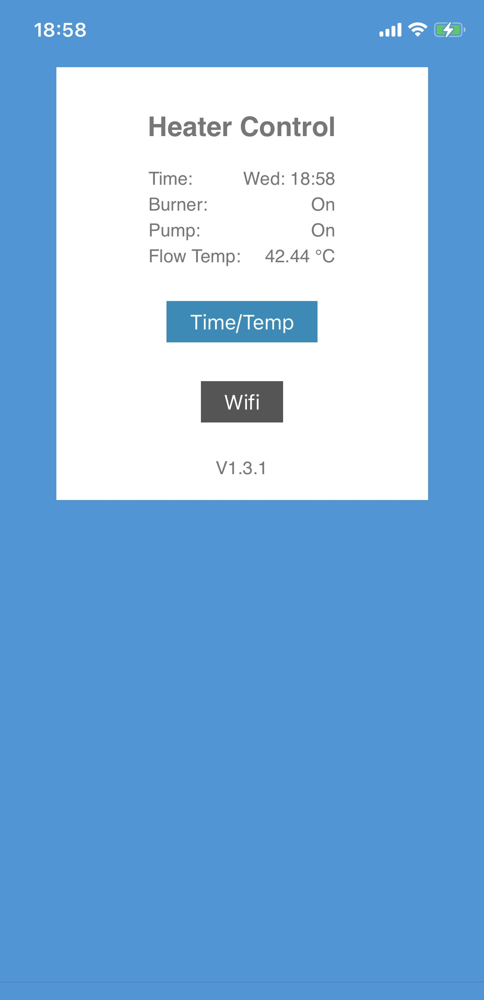
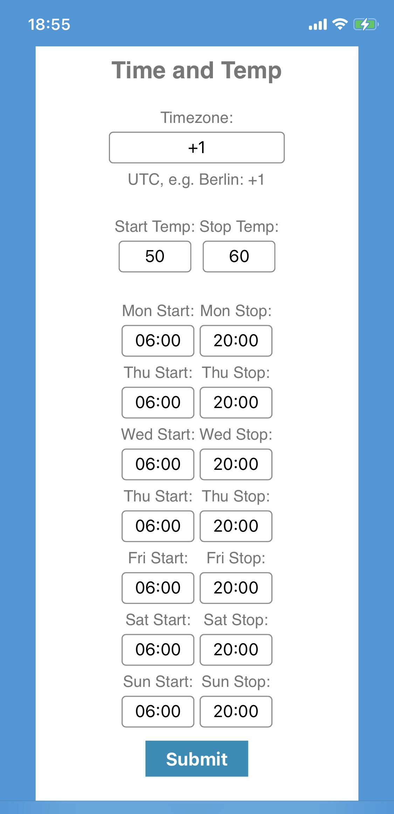
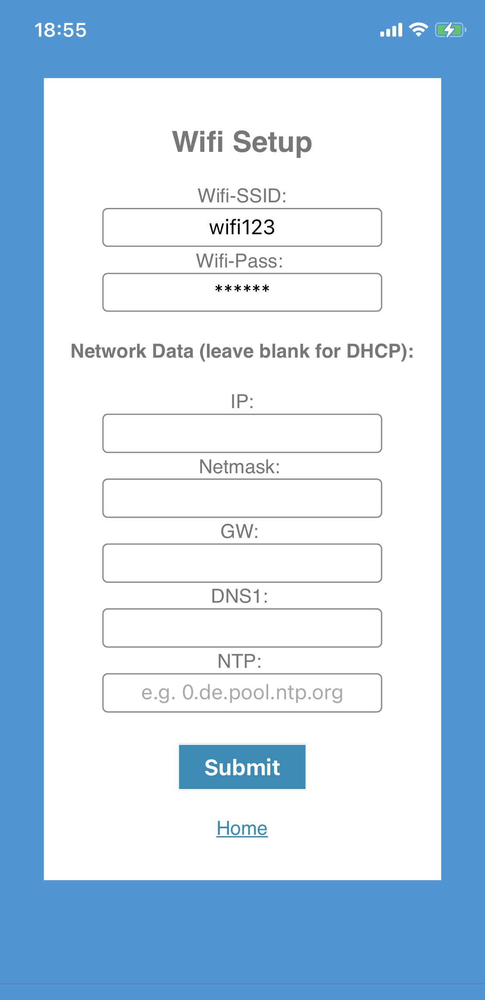
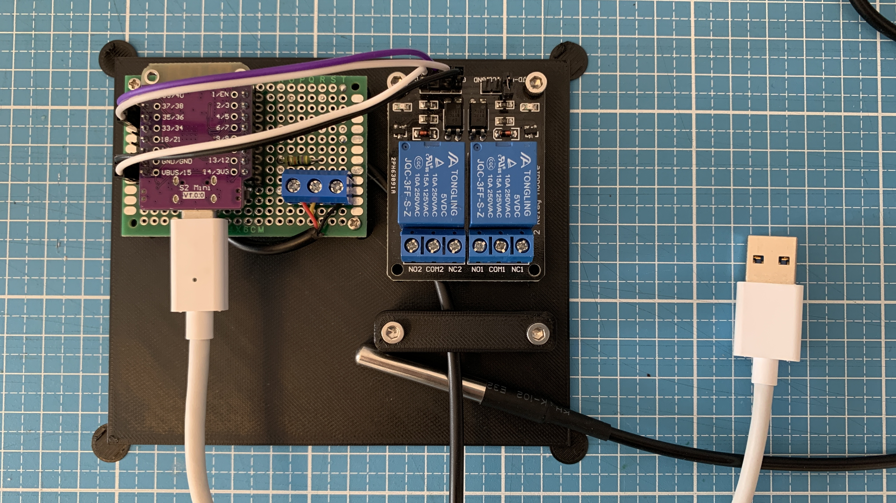

# Heater control

This project could be interesting for everyone, who is looking for an alternative/replacement heater control unit for any oil or gas burner.
The system controls the general heating time per day, e.g. Monday from 06:00 to 20:00. Hysteresis via start and the stop temp, e.g. 45 degrees burner start and 60 degrees burner stop temp, when them is back to 45 degrees the burner switches on again...
The circulation pump is controlled as well, it starts with the daily start time and ends with the daily stop time + 15 min, in order to give the oven a bit time to cool down.
The system is written in Micropython.

## Software images

<pre>&#9;&#9;&#9</pre>

## Device images

<pre></pre>

## Features

- Intuitive web frontend
- System works without any cloud service, but need ntp connection for current time
- Standard hardware

## Communication

- Standard wireless LAN connection based on 802.11
- Simple wifi setup via web frontend (DHCP or fixed IP)

## Functions

- Easy setup for all functions
- Everything is controlable via integrated web frontend
- Start / Stop timer for every weekday
- Start / Stop temp control

## Getting started

- Install the latest Micropython release on your ESP-32
- Copy the content of the zip release file to ESP's root directory
- Reboot the ESP and search for Wifi SSID "HeaterControl" and connect, Wifi password is 123456789
- Open a web browser, enter the configuration site http://192.168.4.1 and configure the device as needed

## Whats needed?

- ESP-32 with Micropython
- Relays
- DS18B20 temp sensor
- Any 5v power supply for your ESP

## Connection schematic

...

## Donate
If you would like to support the developer with a cup of coffee you can do that via [Paypal](https://www.paypal.com/donate/?hosted_button_id=SZ7XHCJKESK3E)
